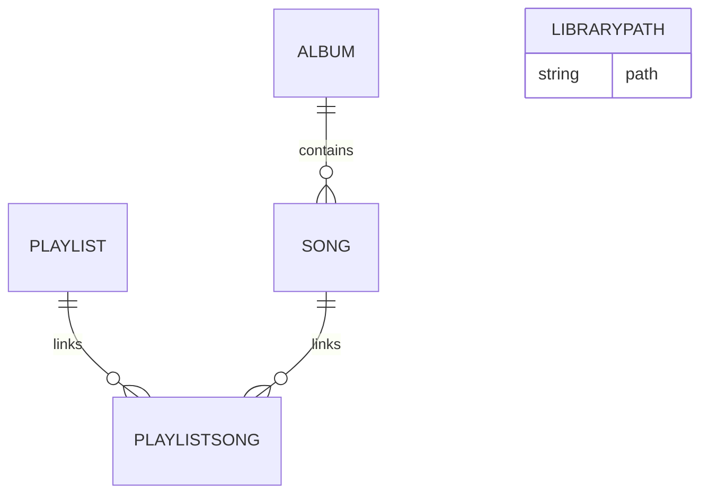

# Tremors Music - Developer Documentation

> Comprehensive documentation for developers working on Tremors Music, covering architecture, setup, and contribution guidelines.

**Version:** 2.0.2 | **Last Updated:** 2026-01-14

---

## Table of Contents

- [Architecture Overview](#architecture-overview)
- [Project Structure](#project-structure)
- [Database Schema](#database-schema)
- [API Routes](#api-routes)
- [Development Setup](#development-setup)
- [Building & Deployment](#building--deployment)
- [Code Style & Standards](#code-style--standards)
- [Troubleshooting](#troubleshooting)

---

## Architecture Overview

Tremors Music follows a **Sidecar Pattern** architecture, where a high-performance Python backend is managed by a native Tauri shell.

```
┌─────────────────────────────────────────────────────────────┐
│                      Tremors Music                           │
├─────────────────────────────────────────────────────────────┤
│  ┌─────────────────┐     ┌───────────────────────────────┐  │
│  │   Tauri Shell   │────▶│      React Frontend           │  │
│  │   (Rust)        │     │      (UI, Player, State)      │  │
│  └─────────────────┘     └───────────────┬───────────────┘  │
│                                          │ HTTP API         │
│                            ┌─────────────▼───────────────┐  │
│                            │      Python Backend         │  │
│                            │      (FastAPI + SQLite)     │  │
│                            └─────────────────────────────┘  │
└─────────────────────────────────────────────────────────────┘
```

### Key Design Decisions

| Decision | Rationale |
|----------|-----------|
| **Python Sidecar** | Leverages Mutagen for robust metadata extraction and FastAPI for streaming logic while maintaining desktop performance. |
| **Local-First** | No external dependencies or cloud accounts required. All music and data stay on the user's machine. |
| **Virtualized Lists** | Used in the frontend to handle massive libraries (10k+ songs) without UI lag. |
| **Zustand State** | Lightweight and efficient state management for the player and queue logic. |

---

## Project Structure

```
tremors-music/
├── backend/                # Python FastAPI backend
│   ├── main.py            # App entry point & Logging setup
│   ├── database.py        # SQLite connection handles
│   ├── models.py          # SQLModel schemas
│   ├── scanner.py         # Library scanner & Tag extraction
│   ├── streamer.py        # Audio streaming logic
│   └── router/            # API endpoint groups
├── frontend/               # React TypeScript frontend
│   ├── src/
│   │   ├── components/    # Reusable UI components
│   │   ├── pages/         # Route-level components
│   │   ├── stores/        # Zustand state definitions
│   │   └── lib/           # Axios API wrappers & Utilities
├── tauri/                  # Tauri desktop wrapper
│   ├── src-tauri/         # Rust source & Configuration
│   └── scripts/           # build-backend.mjs for sidecar packaging
└── assets/                 # Logo and branding assets
```

---

## Database Schema

### Models Overview

| Model | Purpose | Key Fields |
|-------|---------|------------|
| **Song** | Core music track data | `title`, `artist`, `album_id`, `path`, `duration`, `lyrics` |
| **Album** | Collection of songs | `title`, `artist`, `year`, `genre`, `cover_path` |
| **Playlist** | User-created song lists | `name`, `songs` (Relationship) |
| **LibraryPath** | Folders to be scanned | `path` (Unique) |

### Relationships Diagram



---

## API Routes

### Library Management

| Method | Path | Description |
|--------|------|-------------|
| GET | `/library/songs` | Paginated song list (metadata only) |
| GET | `/library/albums` | Album list with song counts |
| GET | `/library/artists` | Artist list with album counts |
| POST | `/library/scan` | Trigger a new library scan |
| GET | `/library/scan/status` | Real-time scanner progress |
| POST | `/library/scan/stop` | Stop the current scan |
| DELETE | `/library/reset` | Rescan & Prune or Wipe library |
| GET | `/library/search?q=...` | Optimized multi-category search |

### Playlists

| Method | Path | Description |
|--------|------|-------------|
| GET | `/playlists/` | Get all user playlists |
| POST | `/playlists/` | Create a new playlist |
| GET | `/playlists/{id}/songs` | Get all songs in a playlist |
| POST | `/playlists/{id}/add` | Add songs to a playlist |
| POST | `/playlists/{id}/reorder` | Update playlist song order |
| DELETE | `/playlists/{id}` | Delete a playlist |

### Smart Playlists & Genres

| Method | Path | Description |
|--------|------|-------------|
| GET | `/library/genres` | Get all unique genres |
| GET | `/library/smart-playlists/favorites` | Songs with 5-star rating |
| GET | `/library/smart-playlists/recently-added` | Last 50 added songs |
| GET | `/library/smart-playlists/most-played` | Top played songs |
| POST | `/library/songs/{id}/favorite` | Toggle 5-star rating |
| POST | `/library/songs/{id}/play` | Increment play count |

### Media & Streaming

| Method | Path | Description |
|--------|------|-------------|
| GET | `/stream/{song_id}` | Range-based audio streaming |
| GET | `/covers/{album_id}` | Album artwork retrieval |
| GET | `/lyrics/{song_id}` | Retrieve song lyrics (fully offline) |

---

## Development Setup

### Prerequisites

- **Node.js** v18+
- **Python** v3.11+
- **uv** - Python package manager (`pip install uv`)
- **Rust** - For Tauri builds ([rustup.rs](https://rustup.rs))

### 1. Installation

```bash
# Clone the repo
git clone https://github.com/qtremors/tremors-music.git
cd tremors-music

# Backend Dependencies
cd backend && uv sync && cd ..

# Frontend Dependencies
cd frontend && npm install && cd ..

# Tauri Dependencies
cd tauri && npm install && cd ..
```

### 2. Browser Development (Web Mode)
Use this mode for rapid UI development without the native shell.

**Terminal 1: Python Backend**
```bash
cd backend
uv run uvicorn main:app --reload
# API runs at http://localhost:8000
```

**Terminal 2: React Frontend**
```bash
cd frontend
npm run dev
# App runs at http://localhost:5173
```

### 3. Desktop Development (Tauri Mode)
Use this mode to test native features (system tray, global shortcuts, file system) in the actual application shell.

```bash
cd tauri
npm run dev
```
> **Note:** This command automatically starts the Frontend and Backend in the background.

---

## Building & Deployment

### Build for Browser (Static Web App)
Generates static files for web servers (Nginx, Vercel, Netlify).

```bash
cd frontend
npm run build
# Output: frontend/dist/
```

### Build for Desktop (Windows/macOS)
Generates native installers (`.exe`, `.msi`, `.dmg`).

```bash
cd tauri
npm run build
```
> **What this does:**
> 1. Compiles the Python backend into a standalone executable (Sidecar).
> 2. Builds the React frontend into static assets.
> 3. Bundles everything into a native Tauri installer.
>
> **Output:** `tauri/src-tauri/target/release/bundle/`

---

## Code Style & Standards

### Frontend (React/TS)
- Use **functional components** with hooks.
- **Zustand** for global player and UI state.
- **Tailwind CSS** for all styling; avoid inline styles.
- **TypeScript** strict mode is enforced.

### Backend (Python)
- Follow **PEP 8** guidelines.
- Use **Type Hints** for all function signatures.
- **SQLModel** for database interactions.
- **FastAPI** for all endpoint definitions.

---

## Troubleshooting

### Common Issues

| Issue | Solution |
|-------|----------|
| **Backend not starting** | Ensure `uv` is installed and `uv sync` was run in the `backend/` folder. Check logs in `backend/logs/`. |
| **Lyrics not showing** | Verify the audio file contains ID3 USLT or M4A lyric tags. Local files only. |
| **Scanner stuck** | You can manually trigger a "Hard Reset" via the API `DELETE /library/reset?hard=true` to clear the database. |

---

## Contributing

### Pull Request Process

1. Fork the repository
2. Create a feature branch (`git checkout -b feature/amazing-feature`)
3. Make your changes and commit with clear, descriptive messages
4. Ensure your code follows the established [Code Style](#code-style--standards)
5. Push to your fork and open a Pull Request against the `main` branch
6. Provide a clear summary of your changes in the PR description

---

<p align="center">
  <a href="README.md">← Back to README</a>
</p>
