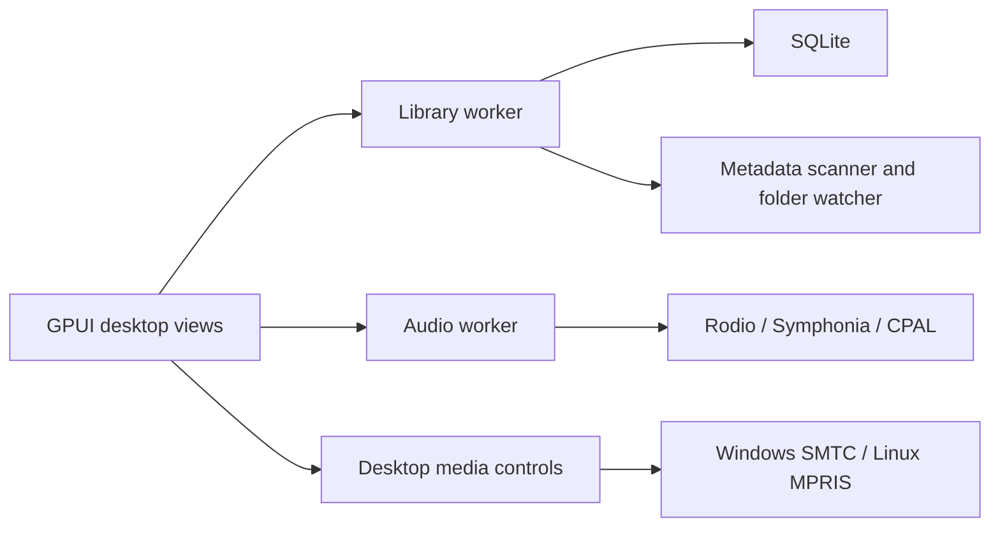

# Tremors Music - Developer Documentation

Architecture, repository conventions, setup, builds, and verification for the native Rust application. Run Cargo commands from `tremors-music-app/`.

## Contents

- [Repository structure](#repository-structure)
- [Architecture](#architecture)
- [Technology stack](#technology-stack)
- [Runtime flow](#runtime-flow)
- [Setup and local development](#setup-and-local-development)
- [Naming and versioning](#naming-and-versioning)
- [Builds and distribution](#builds-and-distribution)
- [Configuration and privacy](#configuration-and-privacy)
- [Verification](#verification)
- [Troubleshooting](#troubleshooting)
- [Third-party notices](#third-party-notices)
- [Website architecture and maintenance](#website-architecture-and-maintenance)
- [Maintenance](#maintenance)

## Repository structure

```text
tremors-music/
├── README.md                  # Product overview and getting started
├── DEVELOPMENT.md             # Architecture and developer entry point
├── CHANGELOG.md                # Version-specific user-visible changes
├── TASKS.md                    # Known issues and unfinished work
├── LICENSE.md                  # Project license and complete GPL text
├── PRIVACY.md                  # User-facing local data and privacy policy
├── assets/                     # Canonical TremorsMusic.svg/.png/.ico branding
├── docs/                       # Static GitHub Pages website only
│   ├── index.html              # Product landing page
│   ├── scripts.js              # Live GitHub release metadata and statistics
│   ├── styles.css
│   └── assets/                 # Website copies of canonical branding
└── tremors-music-app/           # Cargo workspace and application tooling
    ├── Cargo.toml, Cargo.lock
    ├── rust-toolchain.toml
    ├── .cargo/                 # Target configuration
    ├── crates/
    │   ├── core/               # Library, metadata, scanning, playback and state
    │   └── desktop/            # GPUI application, startup and media integration
    ├── installer/              # NSIS recipe and build-tool license notices
    ├── scripts/                # Platform packaging and shader tooling
    ├── third-party/            # Patched Windows renderer and shaders
    ├── target/                 # Ignored Cargo output
    └── dist/                   # Ignored versioned distribution artifacts
```

Root Markdown files cover the product, development, licensing, privacy, changes, and unfinished work. `README.md` introduces the app and its usage; `PRIVACY.md` explains data handling and user controls. Architecture, checklists, builds, dependency notices, and website maintenance live here. Verification status and outstanding work live in `TASKS.md`. The root `docs/` directory contains only the product website and its assets. Generated packages, logs, databases, and vendored packaging sources are not tracked.

## Architecture


```mermaid
flowchart LR
    UI[GPUI desktop views] --> Library[Library worker]
    UI --> Audio[Audio worker]
    UI --> Media[Desktop media controls]
    Library --> DB[SQLite]
    Library --> Scanner[Metadata scanner and folder watcher]
    Audio --> Decoder[Rodio / Symphonia / CPAL]
    Media --> OS[Windows SMTC / Linux MPRIS]
```

`tremors-core` owns models, persistence, scanning, browsing, lyric timing, queues, preferences, and playback services. It does not depend on the desktop crate or GPUI. `tremors-music` composes those capabilities into desktop views and platform integration. Keep product behavior in core services where possible; introduce additional crates only when a concrete dependency boundary warrants one.

Routine database work and decoding run on workers. UI polling drains events every 100 ms and repaints on change. Lists and galleries use `uniform_list`; row models share songs through `Arc`, and parsed current-track lyrics are cached. Shutdown saves playback state synchronously so a final queued save is not lost.

### Library and scanning

SQLite uses WAL and foreign keys. Playlist entries have independent IDs to preserve duplicates. Track upserts preserve favorites, play counts, and dates. Fingerprints use file size, nanosecond modification time, and sidecar lyric modification time; unchanged files avoid tag and artwork parsing.

Cancelled folders do not partially replace state; missing roots retain their tracks. Traversal errors disable pruning, parse failures still mark a file seen, and symbolic-link directories are not followed. Folder relocation retains IDs at matching relative paths and rejects destination conflicts transactionally. Reset operations remove records after confirmation; music files are never modified.

`notify` watches registered folders recursively. Access events are ignored; changes debounce for 1.5 seconds with a five-second scan interval. Unavailable roots are retried. Idle watchers query only small folder and preference records. Artwork cleanup deletes only scanner-generated, unreferenced PNG names.

### Audio, queues, and lyrics

Rodio and Symphonia stream supported codecs; CPAL uses WASAPI on Windows and ALSA on Linux. Devices open lazily. Generation IDs discard stale responses, device errors allow reconnecting with Play, and seek errors are nonfatal. ReplayGain track gain is peak-limited independently of user volume.

Queue entries preserve duplicate identity through shuffle and reorder. Repeat one applies on completion; manual Next advances. Persistence saves IDs, permutation, cursor, and position, validates corrupted orders, and removes missing songs. Position saves run every five seconds; reopening stays paused.

Souvlaki connects Windows SMTC and Linux MPRIS through local events. Artwork uses encoded local file URLs. LRC supports multiple timestamps, offsets, highlighting, and seeking. Lofty supplies embedded lyrics; millisecond ID3 SYLT converts to LRC. Size-limited UTF-8 `.lrc` sidecars take precedence. MPEG-frame SYLT timestamps are not converted.

### Local data

The app uses the `Tremors Music` data directory and `library.sqlite3`. Music folders shows the exact location; `TREMORS_DATA_DIR` overrides it for isolated tests.

## Technology stack

| Area | Technology and responsibility |
| --- | --- |
| Language and build | Rust, Cargo workspace, pinned toolchain and lockfile |
| Desktop UI | GPUI Kit and GPUI, native views and virtualized lists |
| Persistence | SQLite through Rusqlite, bundled SQLite, WAL and foreign keys |
| Audio | Rodio and Symphonia for decoding, CPAL for device output |
| Metadata and artwork | Lofty and Image, local tags, embedded covers and lyrics |
| Folder updates | Notify, recursive watching and debounced incremental scans |
| Desktop integration | Souvlaki for Windows SMTC and Linux MPRIS; RFD for folder pickers |
| Packaging | PowerShell and NSIS on Windows; native shell archives on Linux |
| Website | Static HTML, CSS, JavaScript and public GitHub metadata |

Exact dependency versions live in the Cargo manifests and lockfile. The workspace patches the Windows GPUI renderer under `third-party/`; shader and licensing details are under [Third-party notices](#third-party-notices).

## Runtime flow

1. Startup opens a local diagnostic log and installs an error handler. Data paths come from `AppPaths`.
2. GPUI initializes bundled assets, theme state, and keyboard bindings, then creates the desktop window.
3. The desktop composes a library worker, audio worker, and platform media controls. The library worker opens SQLite and publishes its initial snapshot.
4. Worker events update views. Search and sorting rebuild browsing state; virtualized lists draw visible items. Scans and decoding run outside the UI thread.
5. Folder watches enqueue debounced scans. Queue, position, and preferences are persisted; reopening restores playback paused.
6. Shutdown saves playback state synchronously before the process exits.

## Setup and local development

```bash
git clone https://github.com/qtremors/tremors-music.git
cd tremors-music/tremors-music-app
```

`rust-toolchain.toml` and the committed `Cargo.lock` pin the toolchain and dependencies. GPUI Kit selects matching GPUI snapshots. Use `--locked` for builds and tests.

### Windows

Install Visual Studio 2022 with Desktop development with C++, a Windows SDK, and NSIS 3.11 or newer. In Developer PowerShell:

```powershell
cargo run --locked -p tremors-music --target x86_64-pc-windows-msvc
.\scripts\build-windows.ps1
```

Native releases target Windows 10 version 1903 or newer and Windows 11 x64. The MSVC C runtime is statically linked. SQLite and icons are bundled. Debug Windows rendering reads shaders from development sources, so debug executables must stay in their development environment.

### Linux

Build on the Linux machine that will run the app. The commands below cover Debian/Ubuntu, Arch/Manjaro, and Fedora. These are source-build prerequisites, not a claim that every distribution has been tested. Native Linux release and hardware checks remain recorded in [TASKS.md](TASKS.md#release-verification). There are no published `.deb`, `.rpm`, AUR, Flatpak, or AppImage packages maintained by this repository.

Install [Rust through rustup](https://rust-lang.org/tools/install/), then reopen your terminal. Cargo selects the version pinned in `rust-toolchain.toml`; a distribution's default Rust package may not match it. Run the commands from `tremors-music-app/` after cloning as shown above.

**Debian / Ubuntu / Mint**

```bash
sudo apt update
sudo apt install git curl ca-certificates build-essential pkg-config libasound2-dev libx11-dev libx11-xcb-dev \
  libxkbcommon-dev libxkbcommon-x11-dev libwayland-dev libfontconfig-dev \
  libfreetype-dev libvulkan-dev libxcb1-dev libxcb-xkb-dev \
  libxcb-render0-dev libxcb-shape0-dev libxcb-xfixes0-dev
```

**Arch / Manjaro**

```bash
sudo pacman -Syu --needed git curl ca-certificates base-devel alsa-lib libx11 libxcb \
  libxkbcommon libxkbcommon-x11 wayland fontconfig freetype2 vulkan-icd-loader
```

**Fedora**

```bash
sudo dnf install git curl ca-certificates gcc gcc-c++ make pkgconf-pkg-config \
  alsa-lib-devel libX11-devel libxcb-devel libxkbcommon-devel \
  libxkbcommon-x11-devel wayland-devel fontconfig-devel freetype-devel vulkan-loader-devel
```

For other distributions, install equivalent C/C++ build tools and ALSA, X11/XCB, XKB, Wayland, Fontconfig/Freetype, and Vulkan development packages. Consult the distribution's package catalogue for names.

**Run or build**

```bash
# Run a development build.
cargo run --locked -p tremors-music

# Test core, build an optimized binary, and create binary/source archives.
CARGO_BUILD_JOBS=2 bash scripts/build-linux.sh
```

The script builds for the host architecture: `x86_64` becomes `x64`, and `aarch64` becomes `arm64`. It does not cross-compile or bundle system libraries. Install the resulting archive from `dist/` using [Linux installation](#linux-installation), or run `./target/release/tremors-music` directly. If `CARGO_TARGET_DIR` is set, the binary is under that directory instead.

**Desktop requirements**

Runtime needs a working Vulkan driver for your GPU, desktop fonts, ALSA, X11/XCB or Wayland with XKB, and a session D-Bus. The development packages above also provide the corresponding runtime libraries. Use your distribution's GPU driver instructions; installing the Vulkan loader alone does not install a GPU driver. On Arch, see the [Vulkan driver guide](https://wiki.archlinux.org/title/Vulkan).

For an already built archive, Rust and the compiler tools are unnecessary. Install the runtime packages using your distribution's package manager:

| Distribution | Runtime packages |
| --- | --- |
| Debian / Ubuntu / Mint | `libasound2` (or `libasound2t64` on distributions using that name), `libx11-6`, `libx11-xcb1`, `libxcb1`, `libxcb-xkb1`, `libxcb-render0`, `libxcb-shape0`, `libxcb-xfixes0`, `libxkbcommon0`, `libxkbcommon-x11-0`, `libwayland-client0`, `libwayland-cursor0`, `fontconfig`, `libfreetype6`, `libvulkan1`, `fonts-dejavu-core`, `dbus` |
| Arch / Manjaro | `alsa-lib`, `libx11`, `libxcb`, `libxkbcommon`, `libxkbcommon-x11`, `wayland`, `fontconfig`, `freetype2`, `vulkan-icd-loader`, `ttf-dejavu`, `dbus` |
| Fedora | `alsa-lib`, `libX11`, `libxcb`, `libxkbcommon`, `libxkbcommon-x11`, `libwayland-client`, `libwayland-cursor`, `fontconfig`, `freetype`, `vulkan-loader`, `dejavu-sans-fonts`, `dbus` |

For folder selection, install `xdg-desktop-portal` and the backend matching your desktop, such as `xdg-desktop-portal-gnome`, `xdg-desktop-portal-kde`, or `xdg-desktop-portal-gtk`. Package managers are `apt`, `pacman`, and `dnf` respectively. Typed folder paths work without a portal. MPRIS uses the desktop's session D-Bus. Verify X11, Wayland, hardware rendering, and physical audio using the [desktop checklist](#desktop-manual-checklist).

### Linux installation

The currently prepared release files are Windows x64. Linux users can build an archive locally using the steps above. If a matching Linux archive is listed on [GitHub Releases](https://github.com/qtremors/tremors-music/releases), the same installation steps apply. A native tar archive is not a distro package: it has no automatic dependency installation or package-manager updates.

Choose the binary archive matching `uname -m`: `linux-x64` for `x86_64`, or `linux-arm64` for `aarch64`. Its accompanying `-source.tar.gz` archive is for source code, not for launching the app. Install the runtime requirements above first. Binary compatibility depends on the build host's glibc and system libraries; when a downloaded binary is incompatible, build from source on your distribution.

From the directory containing the archive and its `.sha256` file, set `archive` to the exact downloaded filename. For a local build, change to `dist/` first:

```bash
archive='TremorsMusic-<version>-linux-<architecture>.tar.gz'
sha256sum -c "$archive.sha256" &&
  tar -xzf "$archive" &&
  cd "${archive%.tar.gz}" &&
  ./tremors-music
```

Replace `<version>` and `<architecture>` with the filename's values. Continue only if the checksum succeeds. Run as your regular desktop user. To install for that user, close the app and run these commands from the extracted directory:

```bash
install -Dm755 tremors-music "$HOME/.local/bin/tremors-music"
install -Dm644 tremorsmusic.png "$HOME/.local/share/icons/tremorsmusic.png"
mkdir -p "$HOME/.local/share/applications"
cat > "$HOME/.local/share/applications/tremors-music.desktop" <<EOF
[Desktop Entry]
Type=Application
Name=Tremors Music
Comment=Your music. Your space.
Exec="$HOME/.local/bin/tremors-music"
Icon=$HOME/.local/share/icons/tremorsmusic.png
Terminal=false
Categories=AudioVideo;Audio;Player;
EOF
"$HOME/.local/bin/tremors-music"
```

The app is available in your desktop's application menu. If `~/.local/bin` is on `PATH`, you can also run `tremors-music` from a terminal; otherwise use the full path above. Keep the package's license and source information for redistribution. Updates use the same install commands with a newer matching archive, with the app closed.

To uninstall, close the app and remove only the installed binary, icon, and launcher:

```bash
rm -f -- "$HOME/.local/bin/tremors-music" \
  "$HOME/.local/share/icons/tremorsmusic.png" \
  "$HOME/.local/share/applications/tremors-music.desktop"
```

Music and library data remain on your device. The app's Music folders view shows the data directory; `TREMORS_DATA_DIR` can override it. For a missing shared library, launch the extracted binary from a terminal and inspect its error. Use `ldd ./tremors-music` only on a locally built binary or a trusted release to identify missing dependencies. A glibc-version error requires a compatible build, not copying random shared libraries into the app folder.

### Windows GNU cross-build from Linux

Use the toolchain specified in `rust-toolchain.toml` and install MinGW-w64 with GCC/G++, headers, and binutils. Release builds embed the checked-in shaders; this build step needs no shader compiler or Wine. From `tremors-music-app/`:

```bash
rustup target add x86_64-pc-windows-gnu
export CARGO_TARGET_X86_64_PC_WINDOWS_GNU_LINKER=x86_64-w64-mingw32-gcc
export CC_x86_64_pc_windows_gnu=x86_64-w64-mingw32-gcc
export CXX_x86_64_pc_windows_gnu=x86_64-w64-mingw32-g++
cargo build --locked --release -p tremors-music --target x86_64-pc-windows-gnu
```

The executable is `target/x86_64-pc-windows-gnu/release/tremors-music.exe` relative to the workspace. Inspect DLL imports and include any required non-system runtime DLLs when packaging. The Windows packaging script uses native MSVC; a successful GNU cross-build does not establish native Windows rendering, physical audio, or SMTC behavior.

## Naming and versioning

| Area | Convention | Example |
| --- | --- | --- |
| Project branding | PascalCase product stem | `TremorsMusic.svg` |
| Cargo packages and executables | Lowercase kebab case | `tremors-music`, `tremors-core` |
| Rust modules and functions | Rust snake case | `startup.rs`, `scan_folder` |
| Rust types | Rust PascalCase | `AppPaths` |
| Project and technical Markdown | Uppercase descriptive names | `DEVELOPMENT.md` |
| Scripts and website files | Lowercase kebab case | `build-windows.ps1`, `index.html` |
| Distribution artifacts | Product-version-platform-architecture-kind | `TremorsMusic-<version>-windows-x64-setup.exe` |

`[workspace.package].version` in `Cargo.toml` is the application version source. Both crates inherit it. UI labels, logs, Windows executable resources, and packaging use Cargo's version. Keep the lockfile's local package entries aligned when explicitly changing versions. Public product pages avoid fixed release labels; the website obtains published release metadata from GitHub. Rust desktop packaging has no Android version-code field.

## Builds and distribution

Windows packaging runs core tests, builds an optimized MSVC release, and invokes NSIS. `-SkipTests` is available after an unchanged successful test run. `build-installer.ps1` can package an existing x64 GUI payload without rebuilding Rust. Linux packaging builds a native release by default; optional debug packages carry a `-debug` suffix.

Release output under `tremors-music-app/dist/`:

| Platform | Artifact |
| --- | --- |
| Windows installer | `TremorsMusic-<version>-windows-x64-setup.exe` |
| Windows portable | `TremorsMusic-<version>-windows-x64-portable.zip` |
| Windows corresponding source | `TremorsMusic-<version>-windows-x64-source.zip` |
| Linux x64 | `TremorsMusic-<version>-linux-x64.tar.gz` |
| Linux ARM64 | `TremorsMusic-<version>-linux-arm64.tar.gz` |
| Linux corresponding source | `TremorsMusic-<version>-linux-<architecture>-source.tar.gz` |
| Integrity | Matching `.sha256` file beside each artifact |

The installer installs per user, creates shortcuts and an uninstall entry, and retains library data on removal. Binary packages include the root product, development, license, privacy, changelog, and task documents. `SOURCE.txt` identifies the exact matching source archive and release location. Windows installer and portable packages share one source archive; Linux packages have their own matching source archive. Source archives include the exact local application source, including uncommitted edits, lockfile, scripts, patched renderer, shaders, and vendored Cargo dependency sources and notices. Dependencies keep their own licenses. NSIS is installed separately as a build tool.

Upload each binary, its matching source archive, and all `.sha256` files to the same release. Keep source available at no extra charge wherever the binaries are offered, as described in [GPL section 6(d)](https://www.gnu.org/licenses/gpl-3.0.html#section6). GitHub's automatic source snapshots do not replace these archives of exact build sources and vendored dependencies. Separating source keeps the portable download small without dropping source or notices from distribution.

Release builds optimize for size with thin LTO and stripped symbols. Checked-in bytecode avoids recompiling shaders in ordinary builds. Linux packages depend on host graphics, audio, and font libraries; they are not universal AppImages. Windows builds are unsigned. Build success does not establish renderer or audio-device compatibility.

## Configuration and privacy

`Preferences` stores volume, shuffle, repeat, theme, accent, artwork visibility, folder watching, ReplayGain, and sorting in the local library. Defaults use a dark theme, neutral accent, visible artwork, enabled folder watching, and disabled ReplayGain. There is no required account, backend, or network configuration.

Set `TREMORS_DATA_DIR` to use an isolated library for testing. `AppPaths` creates the directory and cover cache, and selects `library.sqlite3`. Music folders displays the resolved directory. Music and lyric files are read-only inputs; reset and cleanup operations act on application records and generated artwork.

Startup diagnostics use `startup.log` in the data directory, normally `%LOCALAPPDATA%\Tremors\Tremors Music\data\startup.log` on Windows, with `TremorsMusic-startup.log` in the system temporary directory as a fallback. Logs remain local. Desktop media controls expose current-track metadata to the operating system. See [privacy policy](PRIVACY.md) for stored data, backup, reset, removal, and website requests.

## Verification

Run focused checks appropriate to the change:

```bash
cargo test --locked -p tremors-core
cargo fmt --all -- --check
cargo clippy --locked --workspace --all-targets -- -D warnings
```

Core integration tests cover real decoding and seeking, embedded artwork, SQLite persistence, scanner safety, duplicate queues and restoration, lyrics, ReplayGain, relocation, and folder watching. Fixtures are original 440 Hz, 0.25-second tones with test metadata; tests need no FFmpeg or fixture downloads.

Record current verification results, limitations, and outstanding checks in [TASKS.md](TASKS.md). Builds and virtual-display tests do not establish native rendering or physical sound output. Complete the following manual checks before declaring a release ready.

### Desktop manual checklist

Use an isolated `TREMORS_DATA_DIR` and real music on each supported desktop environment. Synthetic fixtures verify codecs, rather than listening quality.

| Area | Checks and expected behavior |
| --- | --- |
| Startup and display | Launch on Windows and Linux; check icons, fonts, resizing, scaling, and window close. Closing the window must exit the process. |
| Folders and scanning | Add native-picked and typed folders, including invalid paths, Unicode names, nested folders, unavailable roots, and overlapping roots. Cancel and rescan without partial replacement. Unchanged files skip parsing; changed tags and sidecar lyrics refresh. Relocation retains matching favorites and playlist entries. |
| Automatic updates | Add and delete files under a registered root; verify automatic imports and pruning after a completed scan. Disable watching and verify imports stop. Unavailable roots retain tracks; removing an overlapping root preserves tracks covered by another. |
| Browsing | Browse songs, albums, artists, genres, favorites, recently added, most played, and playlists. Exercise global and view searches, including song selection below grouped results. Check every sort direction, album disc/track ordering, song menus, and album/artist links. |
| Playlists | Create, rename, and delete playlists. Add duplicate tracks, reorder with buttons and drag-and-drop, and remove one occurrence. Audio files must remain untouched. |
| Queue | Exercise Play next, append, shuffle toggles, reordering, removal, and clear. Current duplicate identity must remain correct. Remove the current track and the final entry while playing and paused. |
| Audio | Play, pause, resume, and seek real MP3, FLAC, PCM WAV, Ogg Vorbis, AAC/ADTS, and AAC/ALAC M4A. Listen for correct speed, pitch, and both channels. Seek while playing, paused, and after completion. Check Previous restart, Next, repeat off/all/one, end of queue, volume, mute, and ReplayGain. |
| Recovery | Try corrupt or missing files; show an error and allow another track to play. Disconnect or change audio output; report the failure and allow Play to reconnect. |
| Persistence | Quit while paused and playing. Reopen with the same queue, cursor, position, and preferences, with playback paused. Remove a saved queued song and verify safe restoration. Track preferences survive metadata rescans. |
| Lyrics | Check plain embedded lyrics, UTF-8 LRC sidecars, and millisecond ID3 SYLT. Verify highlighting, scrolling, and seeking timed lines; change tracks with lyrics and fullscreen open. |
| Appearance and input | Check light/dark themes, every accent, buttons/sliders, artwork visibility, fullscreen, and [all keyboard shortcuts](README.md#keyboard-shortcuts). Text-input spaces and arrows must edit text without changing playback. |
| Media controls | Exercise Windows SMTC and Linux MPRIS Play/Pause/Next/Previous/Seek/Volume and metadata while the app is unfocused. Check local artwork URLs containing spaces and Unicode. |
| Data safety | Remove roots, reset an isolated library with and without retained roots, and check confirmations. Music and lyrics remain on disk. Generated-artwork cleanup preserves referenced covers. |
| Performance and accessibility | Measure release startup, scanning, scrolling, memory, and CPU on a large real library. Check focus order, keyboard access, and display scaling before making performance or accessibility claims. |

### Windows installer checklist

- Run setup as a normal user. It installs under the user's local Programs directory without an administrator prompt.
- Verify desktop and Start menu shortcuts open the installed app. Windows Installed apps shows the correct name, version, and uninstaller.
- Reinstall and confirm the recorded installation location is reused.
- Uninstall with the app closed. Application files, shortcuts, and the uninstall entry disappear. Music, the library database, cached artwork, and user-created files placed in the installation directory remain.
- Keep the matching corresponding-source archive alongside any redistributed installer.

### Recording results

Record the OS version, graphics and audio devices, compiler target/build profile, codecs tested, library size, commands, results, and failures. Capture startup dialog text and the local diagnostic log when investigating launch failures. Virtual displays, software rendering, synthetic tones, null sinks, cross-builds, and Wine checks do not establish physical graphics/audio or native Windows behavior. Linux Wayland and desktop portal selection require their own runtime checks.

## Troubleshooting

| Symptom | Check |
| --- | --- |
| Windows app fails before rendering | Read the startup error and local diagnostic log. Use a release package or retain the development shader sources for a debug executable. |
| Windows compiler or resource tool is missing | Run from Visual Studio Developer PowerShell with the C++ tools and Windows SDK installed. |
| No sound or device disconnected | Check desktop audio output and the file's supported codec. Press Play to reconnect after a device error. |
| Linux folder picker is unavailable | Install the desktop portal and its backend, or enter a path directly. |
| Linux media controls are unavailable | Confirm a session D-Bus and a desktop that supports MPRIS. |
| Folder changes do not appear | Check folder availability and the watching preference; run a manual scan. |
| Website counters are unavailable | GitHub's API may be unreachable or rate limited; release and repository links work independently. |

## Third-party notices

### Windows renderer source and shaders

`tremors-music-app/third-party/gpui-pre-windows/` contains GPUI Windows 0.3.7
from crates.io, copyright Zed Industries, licensed under Apache-2.0. Its original
[Apache-2.0 license](tremors-music-app/third-party/gpui-pre-windows/LICENSE-APACHE) and HLSL/Rust source are included. Cargo.lock pins the remaining dependencies.

The local build script embeds checked-in DXBC shaders for release builds on either
a Windows or Linux build host. Upstream release compilation assumes a Windows
host; upstream debug rendering instead reads HLSL files from the build machine's
Cargo source directory. Debug executables therefore must stay in their development
environment and must not be distributed as portable applications. The local
jump-list code also measures its fixed UTF-16 buffer in Rust instead of calling
ICU `u_strlen`, eliminating a GNU import of `icuuc.dll` that is unavailable on
some Windows installations. The replacement is bounded by the actual buffer.

The 18 shader files were compiled from the included, unchanged HLSL sources using
Microsoft Windows SDK 10.0.26100.3916 (`fxc.exe`, compiler 10.1), with `/O3`,
vertex profile `vs_4_1` and pixel profile `ps_4_1`. SHA-256 checksums are recorded
in `shaders/SHA256SUMS`. Regenerate them on Windows with
`tremors-music-app/scripts/compile-shaders.ps1`; ordinary builds use the checked-in
bytecode and do not run the shader compiler. The SDK compiler is a build tool and
is not distributed with the application. Windows and Linux application builds are native; Wine is not a runtime requirement.

Application distribution retains GPL-3.0-only. Dependency licenses and notices
remain with their sources in the corresponding-source package.

### Installer notices

The installer uses unmodified NSIS 3.11 or newer and its LZMA engine. Its third-party
copyright and license texts are in `tremors-music-app/installer/licenses/NSIS.txt` (packaged as `NSIS-LICENSES.txt`), also installed with the app.
NSIS itself is open source; application licensing remains GPL-3.0-only. NSIS is
a build tool, with native compiler packages available for Windows and Linux.
NSIS source is available from [the NSIS project](https://sourceforge.net/projects/nsis/).
The packaging scripts vendor Cargo dependencies; NSIS is installed separately as a build tool.

## Website architecture and maintenance

The public website is a static site under the root `docs/` directory. It uses HTML, CSS, JavaScript, system fonts, and local artwork, with no build step or backend.

| File | Responsibility |
| --- | --- |
| `docs/index.html` | Metadata, product content, navigation, privacy, developer credits, FAQ, and download links |
| `docs/styles.css` | OLED black presentation, typography, responsive grids, focus treatment, and reduced-motion behavior |
| `docs/scripts.js` | Published GitHub release metadata, stars, forks, and asset download counts |
| `docs/assets/` | Website copies of the app branding and developer avatar |

### Local preview and checks

From the repository root:

```bash
python -m http.server 8080 --bind 127.0.0.1 --directory docs
```

Use `python3` on systems where that is the Python command. Open `http://127.0.0.1:8080/` and check desktop, phone, and tablet widths, navigation, FAQ controls, keyboard focus, images, section anchors, and Markdown links. Confirm there is no horizontal overflow and that the site remains usable without JavaScript or an available GitHub API. Stop the preview server after testing.

At 760px and below, navigation moves to a second header row and content grids stack. At 360px and below, counters use two columns. The 1000px breakpoint adjusts artwork and typography. Images scale within their containers; reduced-motion preferences disable smooth scrolling.

### Published release metadata

The script reads the public repository, latest release, and paginated releases endpoints. Stars and forks come from repository metadata. Total downloads sum assets across all release pages; latest downloads sum only the latest release's assets. Published tags are displayed as GitHub metadata. Release links let users choose a package without guessing artifact names or hardcoding application versions and statistics.

API requests have a timeout and fail independently. Missing counters remain unavailable, rather than displaying invented values; ordinary repository and download links remain usable.

### Hosting and content

In repository Settings, then Pages, select deployment from the intended branch's `/docs` folder. The project URL is `https://qtremors.github.io/tremors-music/`. Hosting configuration and source edits are separate operations.

Use relative asset links and GitHub source links through `blob/HEAD/`. Keep product copy aligned with README and current implementation. Usage lives in README; build details live here. Navigation uses section anchors and links to Markdown, with one HTML landing page. Keep release summaries in CHANGELOG and current verification status and unfinished work in TASKS.

## Maintenance

Keep public documentation focused on completed behavior, accurate platform support, and current capabilities. Keep the current release detailed and summarize earlier releases in `CHANGELOG.md`. Track current verification status, unfinished implementation, and manual checks in `TASKS.md`.

Canonical app branding and the developer avatar live in `assets/`; refresh matching copies in `docs/assets/` together. The static website requires no Node runtime, bundler, external fonts, or backend. Its JavaScript reads public GitHub release metadata and statistics; links remain usable when that API is unavailable. Repository changes do not publish the site, create a release, or configure GitHub CI/CD.
