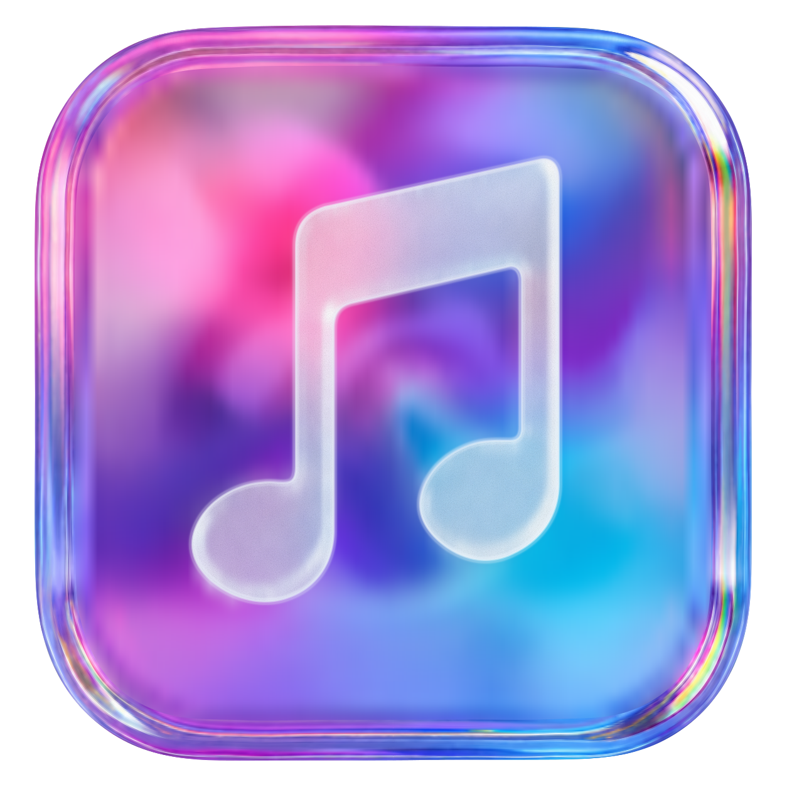

  

<h1 align="center"><a href="https://qtremors.github.io/tremors-music/">Tremors Music</a></h1>

Your music. Your space.

A private, native music player for Windows and Linux.

  

  
  
  
  

  
  

> [!NOTE]
> **Privacy first:** Music, lyrics, playlists, and preferences stay on your device. The desktop app has no accounts, ads, telemetry, or online metadata lookups.

## Why Tremors Music

Tremors Music gives your local music collection a home without accounts, ads, telemetry, or cloud services. Your music and lyric files stay untouched, and your library stays on your device.

## Download

Find packages on [GitHub Releases](https://github.com/qtremors/tremors-music/releases), or build from source using the [developer guide](DEVELOPMENT.md). Open Music folders, add a folder, and choose a track after scanning.

Windows builds include a per-user installer and a portable ZIP, with corresponding source as a separate download. Windows requires Windows 10 version 1903 or newer, or Windows 11, on x64. The currently prepared release files are Windows-only. For Linux, follow the [build instructions for Debian/Ubuntu, Arch, and Fedora](DEVELOPMENT.md#linux), then the [installation guide](DEVELOPMENT.md#linux-installation). Linux builds are native tar archives and need compatible graphics, audio, and font libraries.

## Features

- **Local library:** Browse songs, albums, artists, genres, favorites, recently added, and most played. Search and sort your collection.
- **Music folders:** Choose folders with a native picker or typed paths. Scan incrementally, watch for changes, cancel scans, and relocate folders while retaining matching records.
- **Playback:** Play, pause, seek, shuffle, repeat, adjust volume, and use desktop media controls on Windows and Linux.
- **Queues and playlists:** Play next, add and reorder tracks, preserve duplicate entries, and create, rename, or delete playlists.
- **Resume listening:** Save your queue and position. Reopening restores playback paused.
- **Lyrics:** Read embedded plain lyrics, LRC, and millisecond ID3 SYLT, or matching local `.lrc` files. Follow timed lyrics and select a line to seek.
- **Personalization:** Light and dark themes, seven accents, artwork visibility, fullscreen playback, and keyboard shortcuts.
- **ReplayGain:** Optional track normalization with peak limiting.

Supported formats are MP3, FLAC, PCM WAV, Ogg Vorbis, AAC/ADTS, and AAC or ALAC in M4A. WMA and Opus are not supported.

## Getting started

1. Open the Windows shortcut after installation, or extract the portable ZIP and run `tremors-music.exe`. On Linux, run `tremors-music`.
2. Open **Music folders** and add a folder with the native picker or a typed path.
3. Let the scan finish, then choose a track in Songs, Albums, or Artists.

Create playlists, use Play next, and reorder your queue with buttons or drag-and-drop. The queue and position are saved; reopening restores playback paused. Folder watching picks up changes automatically and can be disabled. Manual rescans, scan cancellation, and folder relocation are available in Music folders.

A matching UTF-8 `.lrc` file takes precedence over embedded lyrics. Timed lyrics highlight during playback; select a line to seek. Music and lyric files stay untouched. Music folders displays the local data directory; see [PRIVACY.md](PRIVACY.md) for storage and reset behavior.

### Keyboard shortcuts

| Shortcut | Action |
| --- | --- |
| Space | Play / pause |
| Left / Right, or Ctrl + Left / Right | Previous / next track |
| Shift + Left / Right | Seek backward / forward 10 seconds |
| Up / Down | Raise / lower volume |
| Ctrl + M | Mute / unmute |
| Ctrl + K, or / | Focus search |
| Ctrl + Q | Show queue |
| Ctrl + L | Show lyrics |
| Ctrl + F, or F11 | Toggle fullscreen player |
| Alt + Left | Go back |
| Escape | Close an overlay / leave fullscreen |

Playback shortcuts are disabled while editing text. Ctrl + K, F11, and Escape remain available in inputs.

## Privacy

The desktop app processes music locally, with no accounts, telemetry, uploads, cloud sync, online metadata lookups, or automatic update checks. Music and lyric files stay untouched.

Read [PRIVACY.md](PRIVACY.md) for stored data, local diagnostics, desktop integration, backup and removal, and the separate requests made by the project website.

## Community and support

- [Project website](https://qtremors.github.io/tremors-music/).
- [GitHub Issues](https://github.com/qtremors/tremors-music/issues) for bugs and feature requests.
- [Changelog](CHANGELOG.md) and [privacy policy](PRIVACY.md).

## Credits

Tremors Music is built by [Tremors](https://github.com/qtremors) with Rust and native desktop tools. Thanks to the maintainers of:

- [Rust](https://www.rust-lang.org/), [GPUI Kit](https://docs.rs/gpui-kit/) and GPUI for the desktop application.
- [SQLite](https://www.sqlite.org/) and [Rusqlite](https://docs.rs/rusqlite/) for local persistence.
- [Rodio](https://docs.rs/rodio/), [Symphonia](https://docs.rs/symphonia/) and [CPAL](https://docs.rs/cpal/) for playback and decoding.
- [Lofty](https://docs.rs/lofty/), [Notify](https://docs.rs/notify/), [Souvlaki](https://docs.rs/souvlaki/) and [Serde](https://serde.rs/) for metadata, folder watching, media controls and state serialization.

The website uses HTML, CSS, JavaScript, system fonts, and the project's own branding. Each dependency retains its own license. Matching source archives include dependency sources and notices; renderer and installer details are in the [third-party notices](DEVELOPMENT.md#third-party-notices).

## For developers

The Rust workspace lives in `tremors-music-app/`, shared branding in `assets/`, and the static website in `docs/`. Architecture, setup, naming, builds, tests, distribution, and specialist documentation are described in [DEVELOPMENT.md](DEVELOPMENT.md).

## License

Tremors Music is licensed under [GNU GPL v3 only](LICENSE.md). That document includes the full license text. Distributed derivatives must preserve notices and provide corresponding source under the GPL.

Made by <a href="https://github.com/qtremors">Tremors</a>

